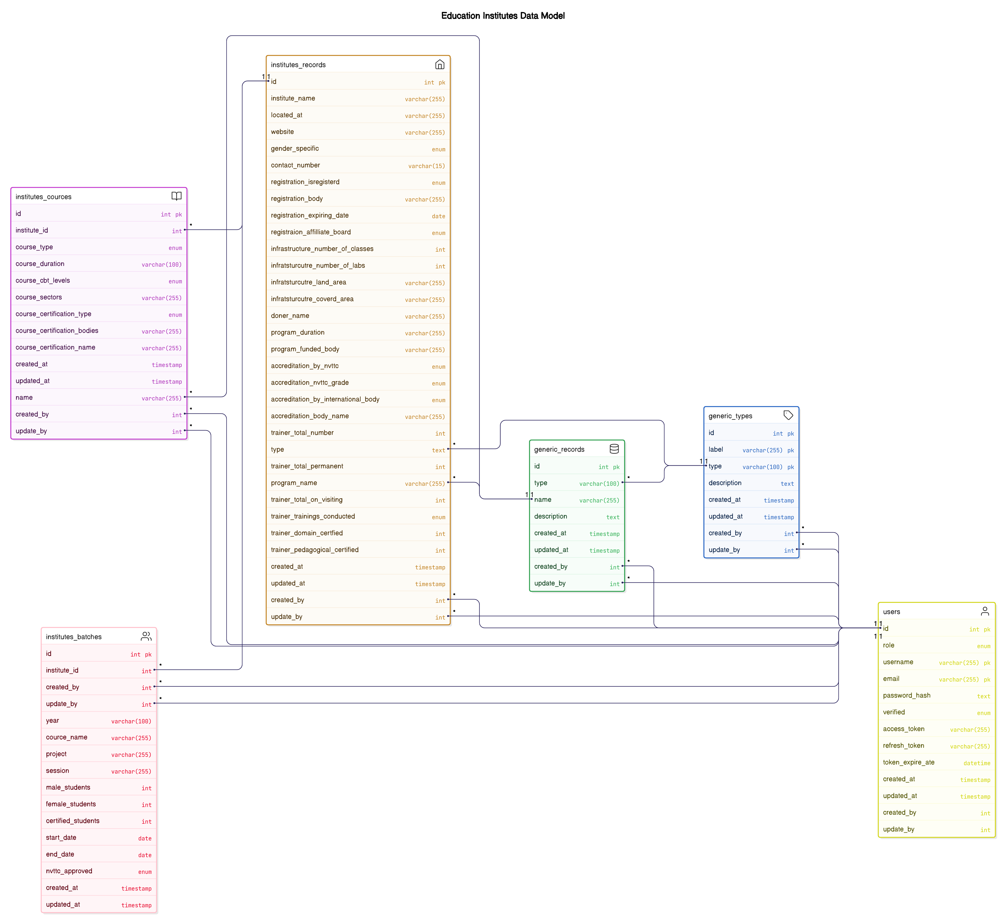

# Institute Registration Dashboard

# Database Schema & Tables

**Table:** users

A table to store users to login into dashboard

There will be no foreign key relations (only virtual relation will be used in backend side)

| **Column** | **Type** | **Keys** | **Data (Default)** | **Is Null** | **Description** |
| --- | --- | --- | --- | --- | --- |
| **id** | int | primary key |  | Not Null | Unique record id |
| **role** | enum |  | [’admin’,’user’] | Not Null | A user will be acces role based |
| **username** | varchar (255) | primary key |  | Not Null | unique username |
| **email** | varchar (255) | primary key |  | Not Null | unique email for the user |
| **password_hash** | text |  |  | Not Null | user hash password encrypted |
| **verified** | enum |  | [’yes’,’no’] | Not Null | Check user is verified or not |
| **access_token** | varchar (255) |  |  | Not Null | a token string to access dashboard during login to prevent un authenticated user |
| **refresh_token** | varchar (255) |  |  | Not Null | a token string to access refresh the access_token during login after access_token expiry |
| **token_expire_ate** | DATETIEM |  |  | Not Null | Date and time to store token expiry |
| **created_at** | Timestamp |  | Now() | Not Null | Current timestamp |
| **updated_at** | Timestamp |  | Now() | Not Null | Current Timestamp and on update timestamp |
| **created_by** | int |  | 0 | Null | Record created by the logged user |
| **update_by** | int |  | 0 | Null | Record updated by the logged user |

**Table:** generic_types

A generic types of tables to store generic type like (states, tehsils, ministries)

There will be no foreign key relations (only virtual relation will be used in backend side)

| **Column** | **Type** | **Keys** | **Data (Default)** | **Is Null** | **Description** |
| --- | --- | --- | --- | --- | --- |
| **id** | int | primary key |  | Not Null | Unique record id |
| **label** | varchar (255) | primary key |  | Not Null | label will be unique |
| **type** | varchar (100) | primary key |  | Not Null | type will be unique |
| **description** | text |  |  | Null | Explanation of type |
| **created_at** | Timestamp |  | Now() | Not Null | Current timestamp |
| **updated_at** | Timestamp |  | Now() | Not Null | Current Timestamp and on update timestamp |
| **created_by** | int |  | 0 | Null | Record created by the logged user |
| **update_by** | int |  | 0 | Null | Record updated by the logged user |

**Table:** generic_records

A table to store all generic records in a one table by different with type.

There will be no foreign key relations (only virtual relation will be used in backend side)

| **Column** | **Type** | **Keys** | **Data (Default)** | **Is Null** | **Description** |
| --- | --- | --- | --- | --- | --- |
| **id** | int | primary key |  | Not Null | Unique record id |
| **type** | varchar (100) |  |  | Not Null | type form generic types |
| **name** | varchar (255) |  |  | Not Null | name of record |
| **description** | text |  |  | Null | Explanation of record |
| **created_at** | Timestamp |  | Now() | Not Null | Current timestamp |
| **updated_at** | Timestamp |  | Now() | Not Null | Current Timestamp and on update timestamp |
| **created_by** | int |  | 0 | Null | Record created by the logged user |
| **update_by** | int |  | 0 | Null | Record updated by the logged user |

**Table:** institutes_records

A table to store all Institutes records.

There will be no foreign key relations (only virtual relation will be used in backend side)

| **Column** | **Type** | **Keys** | **Data (Default)** | **Is Null** | **Description** |
| --- | --- | --- | --- | --- | --- |
| **id** | int | primary key |  | Not Null | Unique record id |
| **institute_name** | varchar (255) |  |  | Not Null | type form generic types |
| **located at** | varchar (255) |  |  | Not Null | location of tehsils |
| **type** | text |  |  | Null | Registration type (Govt, Private) |
| **website** | varchar (255) |  |  | Null |  |
| **gender_specific** | enum |  | [’male’,’female’,’both’] | Null | Is this institute is specified for (male, female or both) |
| **contact_number** | varchar (15) |  |  | Null | Institiute Contact Number |
| **registration_isregisterd** | enum |  | [’yes’,’no’] | Not Null | Yes Or No options |
| **registration_body** | varchar (255) |  |  | Not Null | Registration body selected from generic record |
| **registration_expiring_date** | date |  | Now() |  | Registration expiring date |
| **registraion_affilliate_board** | enum |  | [’yes’,’no’] | Not Null | Is this institute is registerd with any affiliated board |
| **infrastructure_number_of_classes** | int |  | 0 | Not Null | Total number of classes in institute |
| **infratsturcutre_number_of_labs** | int |  | 0 | Not Null | Total number of labs in institute |
| **infratsturcutre_land_area** | varchar (255) |  |  | Null | Land area for institute |
| **infratsturcutre_coverd_area** | varchar (255) |  |  | Null | Covered area for institute |
| **doner_name** | varchar (255) |  |  | Null | Doner name |
|  |  |  |  |  |  |
|  |  |  |  |  |  |
|  |  |  |  |  |  |
| **program_name** | varchar (255) |  |  | Null | Program name under institute |
| **program_duration** | varchar (255) |  |  | Null | Program duration |
| **program_funded_body** | varchar (255) |  |  | Null | Selected from generic records |
| **accreditation_by_nvttc**  | enum |  | [’yes’,’no’] | Not Null | Is this institute is accredited by NVTTC |
| **accreditation_nvttc_grade** | enum |  | [’a’,’b’,’c’,’d’] | Not Null | NVTTC Accreditation grades |
| **accreditation_by_international_body** | enum |  | [’yes’,’no’] | Not Null | Is accredited by international body |
| **accreditation_body_name** | varchar (255) |  |  | Null | International Accreditation Body Name |
| **trainer_total_number** | int |  | 0 | Null | Number of total Trainers |
| **trainer_total_permanent** | int |  | 0 | Null | Number of total Permanent Trainers |
| **trainer_total_on_visiting** | int |  | 0 | Null | Number of total Visiting Trainers |
| **trainer_trainings_conducted** | enum |  | [’yes’,’no’] | Not Null | Is this institute conducts trainings for their trainers |
| **trainer_domain_certfied** | int |  | 0 | Not Null | Total Number of domain certified trainers |
| **trainer_pedagogical_certified** | int |  | 0 | Not Null | Total Number of pedagogical certified trainers |
| **created_at** | Timestamp |  | Now() | Not Null | Current timestamp |
| **updated_at** | Timestamp |  | Now() | Not Null | Current Timestamp and on update timestamp |
| **created_by** | int |  | 0 | Null | Record created by the logged user |
| **update_by** | int |  | 0 | Null | Record updated by the logged user |

**Table:** institutes_cources

A table to store all Institutes coerces records by Institiute unique id.

There will be no foreign key relations (only virtual relation will be used in backend side)

| **Column** | **Type** | **Keys** | **Data (Default)** | **Is Null** | **Description** |
| --- | --- | --- | --- | --- | --- |
| **id** | int | primary key |  | Not Null | Unique record id |
| **institute_id** | id |  |  | Not Null | virtual foreign key from institute table |
| **name** | varchar (255) |  |  | Not Null | Cource name |
| **course_type** | enum |  | [’Traditional’,’CBT’’] | Null | Is course is tradational or CBT |
| **course_duration** | varchar (100) |  |  | Null | Cource duration |
| **course_cbt_levels** | enum |  | [’0’,’1’,’2’,’3,’,’4’,’5’] | Null | CBT course levels will be level-0 to level-5 |
| **course_sectors** | varchar (255) |  |  | Null | Selected from generic records |
| **course_certification_type** | enum |  | [’national’, ’international’] | Null | Cource certification type national or internationals |
| **course_certification_bodies** | varchar (255) |  |  | Null | Selected from generic records |
| **course_certification_name** | varchar (255) |  |  | Null | Course certification name |
| **created_at** | Timestamp |  | Now() | Not Null | Current timestamp |
| **updated_at** | Timestamp |  | Now() | Not Null | Current Timestamp and on update timestamp |
| **created_by** | int |  | 0 | Null | Record created by the logged user |
| **update_by** | int |  | 0 | Null | Record updated by the logged user |

**Table:** institutes_batches

A table to store all Institutes batches records by Institiute unique id.

There will be no foreign key relations (only virtual relation will be used in backend side)

| **Column** | **Type** | **Keys** | **Data (Default)** | **Is Null** | **Description** |  |
| --- | --- | --- | --- | --- | --- | --- |
| **id** | int | primary key |  | Not Null | Unique record id |  |
| **institute_id** | id |  |  | Not Null | virtual foreign key from institute table |  |
| **year** | varchar (100) |  |  | Not Null | Year selected from generic records |  |
| **cource_name** | varchar (255) |  |  | Null | cource name for this batch |  |
| **project** | varchar (255) |  |  | Null | selected from generic records |  |
| **session** | varchar (255) |  |  | Null | Session |  |
| **male_students** | int |  | 0 | Null | Number of male students in batch |  |
| **female_students** | int |  | 0 | Null | Number of female students in batch |  |
| **certified_students** | int |  | 0 | Null | Number of certified students |  |
| **start_date** | Date |  |  | Null | Batch start date |  |
| **end_date** | Date |  |  | Null | Batch end date |  |
| **nvttc_approved** | enum |  | [’yes’,’no’] | Null | Batch end date |  |
| **created_at** | Timestamp |  | Now() | Not Null | Current timestamp |  |
| **updated_at** | Timestamp |  | Now() | Not Null | Current Timestamp and on update timestamp |  |
| **created_by** | int |  | 0 | Null | Record created by the logged user |  |
| **update_by** | int |  | 0 | Null | Record updated by the logged user |  |
|  |  |  |  |  |  |  |

## Data Model

